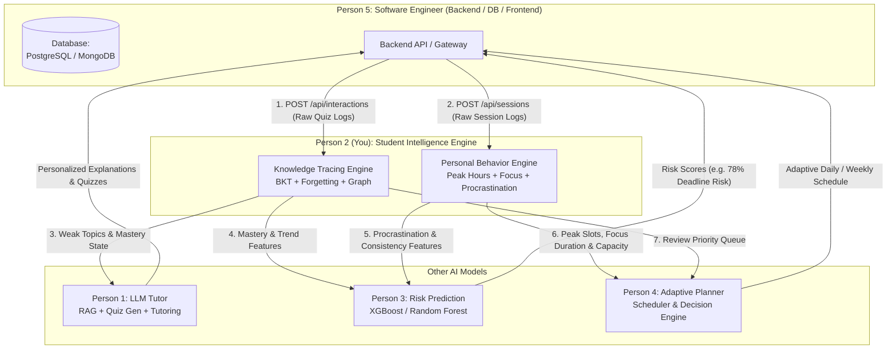
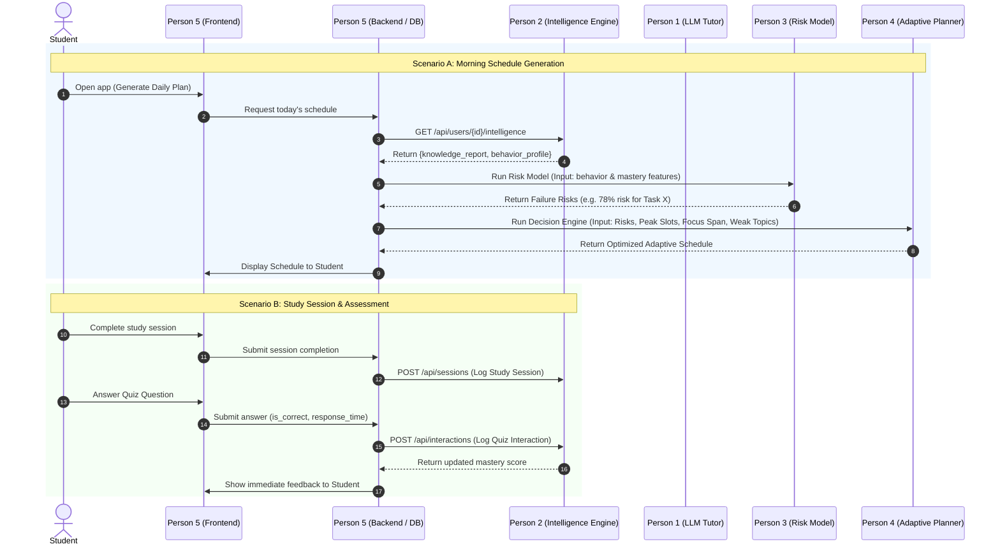

# Backend & Software Engineer Integration Guide (Person 5)
## Student Intelligence Engine — AI Person 2

> **Document Version:** 1.0.0  
> **Target Audience:** Person 5 (Software Engineer / Backend & Full-Stack Developer)  
> **Source Module:** `student_intelligence/` (AI Person 2)  
> **Primary Goal:** Guide Person 5 on how to integrate, trigger, store data for, and consume endpoints from the Student Intelligence Engine.

---

## 1. Executive Summary: What is This Module?

The **Student Intelligence Engine** is the central analytical brain and memory of the system. It continuously answers two core questions:
1. **"What does the student know?"** &rarr; **Knowledge Tracing Engine** (tracks latent mastery $P(L)$, concept weaknesses, prerequisite dependencies, and forgetting curve decay).
2. **"How does the student work?"** &rarr; **Personal Behavior Engine** (discovers circadian peak productivity hours, calculates procrastination scores, determines focus capacity, and tracks consistency streaks).

### Why Does Person 5 (Backend) Need This?
You (Person 5) sit in the center of the architecture. You handle the database, authentication, frontend communication, and model orchestration:
* You **feed** Person 2 raw student interactions (quiz answers and study session logs).
* You **query** Person 2 to get structured intelligence profiles that you pass to Person 1 (LLM Tutor), Person 3 (Risk Model), and Person 4 (Adaptive Planner).

---

## 2. Global Team Data Flow (Who Gives What to Whom)

The diagram below illustrates the exact data exchange between you (Person 5) and all AI engineers:



### Summary of Inter-Person Contracts:

| From | To | What is Transferred | Format / Endpoint |
| :--- | :--- | :--- | :--- |
| **Person 5 (Backend)** | **Person 2 (Intelligence)** | Raw quiz answers (`is_correct`, `response_time`, `difficulty`) | `POST /api/interactions` |
| **Person 5 (Backend)** | **Person 2 (Intelligence)** | Raw session logs (`planned_start`, `actual_start`, `status`) | `POST /api/sessions` |
| **Person 2 (Intelligence)** | **Person 1 (LLM Tutor)** | `weak_topics`, `mastery_score`, `prerequisites` | `GET /api/users/{id}/knowledge` |
| **Person 2 (Intelligence)** | **Person 3 (Risk Model)** | `global_procrastination_score`, `time_estimation_bias`, `consistency_score_7d` | `GET /api/users/{id}/behavior` |
| **Person 2 (Intelligence)** | **Person 4 (Scheduler)** | `peak_slots`, `dead_slots`, `effective_focus_minutes`, `max_daily_study_hours`, `review_priority_queue` | `GET /api/users/{id}/intelligence` |

---

## 3. Integration Modes for Person 5

Person 5 can integrate this module in **one of two ways**:

### Option A: Standalone REST Microservice (Recommended)
Run Person 2 as an independent FastAPI service. Your main backend (FastAPI, Node.js, Django, Go, etc.) calls Person 2 over HTTP.

```bash
# Start Person 2 service on port 8000
uvicorn integration.student_intelligence_api:app --host 0.0.0.0 --port 8000 --reload
```
* **Interactive Swagger UI:** `http://localhost:8000/docs`
* **Health Check:** `GET http://localhost:8000/`

### Option B: Direct In-Process Python Import
If your backend is built entirely with Python, you can import and call `StudentIntelligenceEngine` directly in memory without HTTP overhead:

```python
from integration.student_intelligence_api import StudentIntelligenceEngine
from integration.data_contracts import QuizInteraction, StudySession

# Initialize singleton engine
engine = StudentIntelligenceEngine()

# Log interaction directly
engine.log_quiz_interaction(interaction)

# Retrieve full intelligence profile directly
intelligence = engine.get_full_student_intelligence(user_id="usr_123")
```

---

## 4. API Endpoints & Request/Response Payloads

### Endpoint 1: Log Quiz Interaction
* **URL:** `POST /api/interactions`
* **When Person 5 calls it:** Immediately after a student submits an answer to any quiz or flashcard question.
* **Request Body (`QuizInteraction`):**
```json
{
  "user_id": "usr_101",
  "topic_id": "backpropagation",
  "subject_id": "machine_learning",
  "question_id": "q_482",
  "is_correct": true,
  "response_time_seconds": 24.5,
  "difficulty": 0.7,
  "attempt_number": 1,
  "timestamp": "2026-09-21T14:30:00"
}
```
* **Response:**
```json
{
  "status": "success",
  "new_mastery": 0.6842
}
```

---

### Endpoint 2: Log Study Session
* **URL:** `POST /api/sessions`
* **When Person 5 calls it:** When a student creates, starts, reschedules, or finishes a study task session.
* **Request Body (`StudySession`):**
```json
{
  "user_id": "usr_101",
  "session_id": "sess_902",
  "task_id": "task_45",
  "subject_id": "machine_learning",
  "planned_start": "2026-09-21T19:00:00",
  "actual_start": "2026-09-21T19:20:00",
  "planned_duration_minutes": 60,
  "actual_duration_minutes": 55,
  "status": "completed",
  "postpone_count": 1,
  "timestamp": "2026-09-21T20:15:00"
}
```
* **Response:**
```json
{
  "status": "success"
}
```
*(Valid `status` values: `"completed"`, `"postponed"`, `"cancelled"`, `"in_progress"`).*

---

### Endpoint 3: Get Knowledge State Report
* **URL:** `GET /api/users/{user_id}/knowledge?subject_id=machine_learning`
* **When Person 5 calls it:** When Person 1 (LLM) needs student weaknesses to generate targeted quizzes or explanations.
* **Response (`KnowledgeStateReport`):**
```json
{
  "user_id": "usr_101",
  "overall_mastery": 0.5234,
  "topics": [
    {
      "topic_id": "backpropagation",
      "subject_id": "machine_learning",
      "mastery_score": 0.3541,
      "confidence": 0.8647,
      "trend": "improving",
      "trend_delta": 0.045,
      "status": "weak",
      "review_urgency": "high",
      "days_since_review": 4.2,
      "total_attempts": 18,
      "successful_reviews": 11,
      "predicted_success_prob": 0.452,
      "last_interaction": "2026-09-17T18:40:00"
    }
  ],
  "weak_topics": ["backpropagation", "cnn"],
  "strong_topics": ["linear_regression", "python_programming"],
  "progressing_topics": ["decision_trees"],
  "review_priority_queue": ["backpropagation", "cnn", "svm"],
  "generated_at": "2026-09-21T14:35:00"
}
```

---

### Endpoint 4: Get Behavior Profile
* **URL:** `GET /api/users/{user_id}/behavior`
* **When Person 5 calls it:** When Person 3 (Risk Model) or Person 4 (Scheduler) needs behavioral habits.
* **Response (`BehaviorProfile`):**
```json
{
  "user_id": "usr_101",
  "peak_slots": [
    {
      "start_hour": "19:00",
      "end_hour": "22:00",
      "productivity_score": 0.88
    }
  ],
  "dead_slots": [
    {
      "start_hour": "14:00",
      "end_hour": "16:00",
      "productivity_score": 0.22
    }
  ],
  "effective_focus_minutes": 42.0,
  "max_daily_study_hours": 4.5,
  "global_procrastination_score": 0.42,
  "global_procrastination_level": "medium",
  "per_subject_procrastination": [
    {
      "subject_id": "machine_learning",
      "score": 0.42,
      "level": "medium"
    }
  ],
  "consistency_score_7d": 0.76,
  "consistency_score_14d": 0.68,
  "current_streak_days": 5,
  "momentum": "building",
  "time_estimation_bias": 1.25,
  "profile_confidence": "high",
  "data_points_collected": 74,
  "generated_at": "2026-09-21T14:35:00"
}
```

---

### Endpoint 5: Get Full Student Intelligence
* **URL:** `GET /api/users/{user_id}/intelligence?subject_id=machine_learning`
* **When Person 5 calls it:** When Person 4 (Adaptive Scheduler) needs both Knowledge and Behavior combined to build the daily plan.
* **Response (`StudentIntelligenceOutput`):**
```json
{
  "user_id": "usr_101",
  "knowledge_report": { /* Full KnowledgeStateReport above */ },
  "behavior_profile": { /* Full BehaviorProfile above */ },
  "generated_at": "2026-09-21T14:35:00"
}
```

---

## 5. Database Schema Recommendations for Person 5

Person 5 should ensure the primary database (e.g., PostgreSQL) has the following two tables. These store the exact raw data needed to feed Person 2:

### Table 1: `quiz_interactions`
```sql
CREATE TABLE quiz_interactions (
    id SERIAL PRIMARY KEY,
    user_id VARCHAR(64) NOT NULL,
    topic_id VARCHAR(64) NOT NULL,
    subject_id VARCHAR(64) NOT NULL,
    question_id VARCHAR(64) NOT NULL,
    is_correct BOOLEAN NOT NULL,
    response_time_seconds FLOAT NOT NULL,
    difficulty FLOAT DEFAULT 0.5,
    attempt_number INT DEFAULT 1,
    created_at TIMESTAMP DEFAULT CURRENT_TIMESTAMP
);

CREATE INDEX idx_interactions_user_subject ON quiz_interactions(user_id, subject_id);
```

### Table 2: `study_sessions`
```sql
CREATE TABLE study_sessions (
    id SERIAL PRIMARY KEY,
    session_id VARCHAR(64) UNIQUE NOT NULL,
    user_id VARCHAR(64) NOT NULL,
    task_id VARCHAR(64) NOT NULL,
    subject_id VARCHAR(64) NOT NULL,
    planned_start TIMESTAMP NOT NULL,
    actual_start TIMESTAMP,
    planned_duration_minutes FLOAT NOT NULL,
    actual_duration_minutes FLOAT,
    status VARCHAR(32) NOT NULL, -- 'completed', 'postponed', 'cancelled', 'in_progress'
    postpone_count INT DEFAULT 0,
    created_at TIMESTAMP DEFAULT CURRENT_TIMESTAMP
);

CREATE INDEX idx_sessions_user ON study_sessions(user_id);
```

---

## 6. End-to-End Orchestration Workflow (Sequence Diagram)

Here is a typical day in the application and how Person 5 coordinates the calls:



---

## 7. Codebase Directory Map

```text
student_intelligence/
├── data/
│   ├── knowledge_graph.json          <-- Machine Learning curriculum DAG (23 topics)
│   └── synthetic_generator.py        <-- Generates realistic student logs for testing
├── knowledge_engine/
│   ├── bkt_tracer.py                 <-- Bayesian Knowledge Tracing with bounds hardening
│   ├── forgetting_model.py           <-- Multi-factor Ebbinghaus decay model
│   ├── prerequisite_graph.py         <-- Topological sort & prerequisite graph loader
│   ├── confidence_estimator.py       <-- Statistical confidence saturation metric
│   ├── trend_detector.py             <-- Dual-EMA performance momentum detector
│   └── review_scheduler.py           <-- Priority queue for spaced repetition review
├── behavior_engine/
│   ├── productivity_analyzer.py      <-- Peak and dead productivity hour extractor
│   ├── focus_estimator.py            <-- Median sustained focus span estimator
│   ├── procrastination_tracker.py    <-- Global & per-subject procrastination tracker
│   ├── capacity_analyzer.py          <-- Daily study workload capacity inflection detector
│   ├── consistency_tracker.py        <-- Streak counter & habit momentum adherence
│   └── profile_builder.py            <-- Consolidates behavioral components into one profile
├── integration/
│   ├── data_contracts.py             <-- Pydantic v2 schemas for all inputs & outputs
│   └── student_intelligence_api.py   <-- Central engine class & FastAPI REST server
├── tests/
│   └── test_intelligence.py          <-- Complete automated test suite
└── README.md                         <-- Public GitHub repository documentation
```

---

## 8. Verification & Quick Sanity Check for Person 5

Person 5 can verify that the intelligence service is operational in under 10 seconds:

```bash
# 1. Run unit and integration tests
python tests/test_intelligence.py
# Expected Output: ALL TESTS PASSED!

# 2. Launch FastAPI service
uvicorn integration.student_intelligence_api:app --reload --port 8000

# 3. Test root health check via curl
curl http://localhost:8000/
# Expected: {"service": "Student Intelligence Engine", "status": "healthy", "version": "1.0.0"}
```

---

*Authored by AI Person 2 for Person 5 — Ready for integration into the DEBI Project.*
