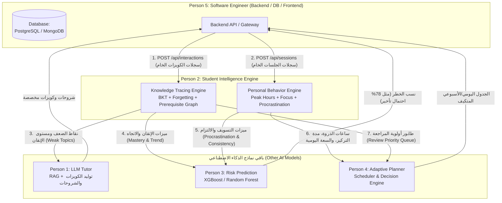
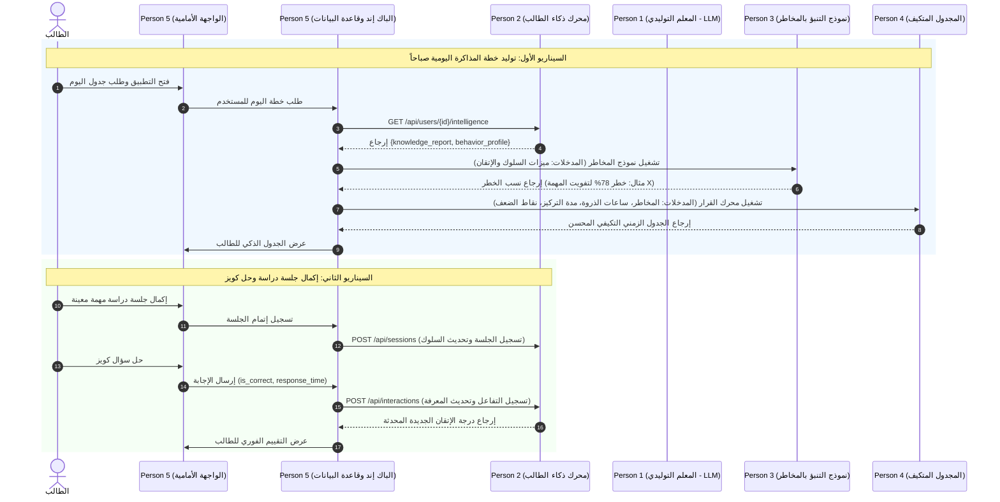

# دليل التكامل لمهندس السوفت وير والباك إند (Person 5)
## محرك ذكاء الطالب — AI Person 2 (Student Intelligence Engine)

> **إصدار الوثيقة:** 1.0.0  
> **الفئة المستهدفة:** Person 5 (Software Engineer / Backend & Full-Stack Developer)  
> **الموديول المصدري:** `student_intelligence/` (AI Person 2)  
> **الهدف الأساسي:** دليل عملي يوضح لـ Person 5 كيفية تشغيل الموديول، الربط مع الـ Endpoints، تصميم جداول قاعدة البيانات، وتوزيع المخرجات لباقي أعضاء الفريق.

---

## 1. نظرة عامة: ما هو هذا الموديول؟ (Executive Summary)

يمثل **Student Intelligence Engine** "العقل التحليلي والذاكرة المركزية" للمنظومة. يقوم الموديول بالإجابة المستمرة عن سؤالين جوهريين:
1. **"ماذا يعرف الطالب؟" (What does the student know?)** &rarr; **Knowledge Tracing Engine**: يتتبع احتمالية إتقان المفاهيم $P(L)$، نقاط الضعف، العلاقات والتبعيات بين المواضيع (Prerequisites DAG)، وأثر النسيان الزمني (Forgetting Curve).
2. **"كيف يدرس ويتصرف الطالب؟" (How does the student work?)** &rarr; **Personal Behavior Engine**: يكتشف ساعات ذروة الإنتاجية (Peak Productivity Hours)، يقيس مؤشر التسويف (Procrastination Index)، يحدد مدى التركيز الفعال (Focus Duration)، ويتابع مؤشر الاستمرارية (Consistency Streak).

### لماذا يحتاج Person 5 (Backend) هذا الموديول؟
أنت (Person 5) بمثابة المحور المركزي للتطبيق؛ تدير قاعدة البيانات، والمصادقة (Authentication)، والواجهات، وتنظيم تدفق بيانات الـ AI Pipelines:
* **أنت تغذي Person 2:** عبر إرسال بيانات إجابات الأسئلة وسجلات جلسات المذاكرة الخام.
* **أنت تستعلم من Person 2:** للحصول على بروفايل ذكي متكامل لتمريره إلى Person 1 (LLM Tutor) و Person 3 (Risk Model) و Person 4 (Adaptive Planner).

---

## 2. خريطة تدفق البيانات بين أعضاء الفريق (Global Team Data Flow)

يوضح المخطط التالي دورة حياة البيانات بدقة بينك (Person 5) وبين جميع مهندسي الذكاء الاصطناعي:



### جدول العقود الصريحة بين الأطراف (Inter-Person Contracts):

| من (Sender) | إلى (Receiver) | ما يتم نقله (Payload / Data) | الـ Endpoint أو الطريقة |
| :--- | :--- | :--- | :--- |
| **Person 5 (Backend)** | **Person 2 (Intelligence)** | إجابات الكويزات الخام (`is_correct`, `response_time`, `difficulty`) | `POST /api/interactions` |
| **Person 5 (Backend)** | **Person 2 (Intelligence)** | سجلات الجلسات الدراسية (`planned_start`, `actual_start`, `status`) | `POST /api/sessions` |
| **Person 2 (Intelligence)** | **Person 1 (LLM Tutor)** | `weak_topics`, `mastery_score`, `prerequisites` | `GET /api/users/{id}/knowledge` |
| **Person 2 (Intelligence)** | **Person 3 (Risk Model)** | `global_procrastination_score`, `time_estimation_bias`, `consistency_score_7d` | `GET /api/users/{id}/behavior` |
| **Person 2 (Intelligence)** | **Person 4 (Scheduler)** | `peak_slots`, `dead_slots`, `effective_focus_minutes`, `max_daily_study_hours`, `review_priority_queue` | `GET /api/users/{id}/intelligence` |

---

## 3. خيارات التكامل والتشغيل المتاحة لـ Person 5

يمكن لـ Person 5 دمج وتشغيل هذا الموديول بإحدى طريقتين:

### الخيار الأول: كخدمة مستقلة عبر شبكة محلية (Standalone REST Microservice) — الخيار الموصى به
تشغيل الموديول كـ Microservice مستقلة مبنية بـ FastAPI. يقوم الباك إند الرئيسي الخاص بك (سواء كان FastAPI, Node.js, Django, Go, إلخ) باستدعائها عبر بروتوكول HTTP:

```bash
# تشغيل سيرفر Person 2 على بورت 8000
uvicorn integration.student_intelligence_api:app --host 0.0.0.0 --port 8000 --reload
```
* **واجهة Swagger التفاعلية للتوثيق والتجربة:** `http://localhost:8000/docs`
* **فحص صحة الخدمة (Health Check):** `GET http://localhost:8000/`

### الخيار الثاني: استدعاء مباشر في الذاكرة (In-Process Python Import)
إذا كان الباك إند بالكامل مكتوباً بلغة Python، يمكنك استيراد كلاس `StudentIntelligenceEngine` واستدعاؤه مباشرة في الذاكرة لتفادي تأخير استدعاءات الشبكة (HTTP Overhead):

```python
from integration.student_intelligence_api import StudentIntelligenceEngine
from integration.data_contracts import QuizInteraction, StudySession

# إنشاء نسخة المحرك (Singleton Engine)
engine = StudentIntelligenceEngine()

# تسجيل تفاعل كويز مباشرة
engine.log_quiz_interaction(interaction)

# طلب البروفايل الشامل للمستخدم مباشرة
intelligence = engine.get_full_student_intelligence(user_id="usr_123")
```

---

## 4. تفاصيل الـ API Endpoints وصيغ البيانات (Request / Response)

### Endpoint 1: تسجيل إجابة كويز (Log Quiz Interaction)
* **المسار:** `POST /api/interactions`
* **متى يستدعيه Person 5:** فور قيام الطالب بحل أو إرسال إجابة أي سؤال (سواء في كويز، امتحان تجريبي، أو Flashcard).
* **جسم الطلب (`QuizInteraction`):**
```json
{
  "user_id": "usr_101",
  "topic_id": "backpropagation",
  "subject_id": "machine_learning",
  "question_id": "q_482",
  "is_correct": true,
  "response_time_seconds": 24.5,
  "difficulty": 0.7,
  "attempt_number": 1,
  "timestamp": "2026-09-21T14:30:00"
}
```
* **الاستجابة (Response):**
```json
{
  "status": "success",
  "new_mastery": 0.6842
}
```

---

### Endpoint 2: تسجيل جلسة مذاكرة (Log Study Session)
* **المسار:** `POST /api/sessions`
* **متى يستدعيه Person 5:** عند إنشاء الطالب لجلسة، بدئها، تأجيلها، إلغائها، أو إكمالها.
* **جسم الطلب (`StudySession`):**
```json
{
  "user_id": "usr_101",
  "session_id": "sess_902",
  "task_id": "task_45",
  "subject_id": "machine_learning",
  "planned_start": "2026-09-21T19:00:00",
  "actual_start": "2026-09-21T19:20:00",
  "planned_duration_minutes": 60,
  "actual_duration_minutes": 55,
  "status": "completed",
  "postpone_count": 1,
  "timestamp": "2026-09-21T20:15:00"
}
```
* **الاستجابة (Response):**
```json
{
  "status": "success"
}
```
*(القيم المقبولة لـ `status`: `"completed"`, `"postponed"`, `"cancelled"`, `"in_progress"`).*

---

### Endpoint 3: استخراج تقرير المعرفة (Get Knowledge State Report)
* **المسار:** `GET /api/users/{user_id}/knowledge?subject_id=machine_learning`
* **متى يستدعيه Person 5:** عندما يطلب Person 1 (الـ LLM Tutor) نقاط ضعف الطالب لتوليد أسئلة أو شروحات مركزة عليها.
* **الاستجابة (`KnowledgeStateReport`):**
```json
{
  "user_id": "usr_101",
  "overall_mastery": 0.5234,
  "topics": [
    {
      "topic_id": "backpropagation",
      "subject_id": "machine_learning",
      "mastery_score": 0.3541,
      "confidence": 0.8647,
      "trend": "improving",
      "trend_delta": 0.045,
      "status": "weak",
      "review_urgency": "high",
      "days_since_review": 4.2,
      "total_attempts": 18,
      "successful_reviews": 11,
      "predicted_success_prob": 0.452,
      "last_interaction": "2026-09-17T18:40:00"
    }
  ],
  "weak_topics": ["backpropagation", "cnn"],
  "strong_topics": ["linear_regression", "python_programming"],
  "progressing_topics": ["decision_trees"],
  "review_priority_queue": ["backpropagation", "cnn", "svm"],
  "generated_at": "2026-09-21T14:35:00"
}
```

---

### Endpoint 4: استخراج البروفايل السلوكي (Get Behavior Profile)
* **المسار:** `GET /api/users/{user_id}/behavior`
* **متى يستدعيه Person 5:** عندما يحتاج Person 3 (نموذج التنبؤ بالمخاطر) أو Person 4 (المجدول) عادات الطالب وسلوكياته.
* **الاستجابة (`BehaviorProfile`):**
```json
{
  "user_id": "usr_101",
  "peak_slots": [
    {
      "start_hour": "19:00",
      "end_hour": "22:00",
      "productivity_score": 0.88
    }
  ],
  "dead_slots": [
    {
      "start_hour": "14:00",
      "end_hour": "16:00",
      "productivity_score": 0.22
    }
  ],
  "effective_focus_minutes": 42.0,
  "max_daily_study_hours": 4.5,
  "global_procrastination_score": 0.42,
  "global_procrastination_level": "medium",
  "per_subject_procrastination": [
    {
      "subject_id": "machine_learning",
      "score": 0.42,
      "level": "medium"
    }
  ],
  "consistency_score_7d": 0.76,
  "consistency_score_14d": 0.68,
  "current_streak_days": 5,
  "momentum": "building",
  "time_estimation_bias": 1.25,
  "profile_confidence": "high",
  "data_points_collected": 74,
  "generated_at": "2026-09-21T14:35:00"
}
```

---

### Endpoint 5: استخراج ذكاء الطالب الموحد (Get Full Student Intelligence)
* **المسار:** `GET /api/users/{user_id}/intelligence?subject_id=machine_learning`
* **متى يستدعيه Person 5:** عندما يريد Person 4 (Adaptive Planner) توليد خطة اليوم بالاعتماد على المعرفة والسلوك معاً في حمولة واحدة (Single Payload).
* **الاستجابة (`StudentIntelligenceOutput`):**
```json
{
  "user_id": "usr_101",
  "knowledge_report": { /* تقرير المعرفة الكامل الموضح أعلاه */ },
  "behavior_profile": { /* البروفايل السلوكي الكامل الموضح أعلاه */ },
  "generated_at": "2026-09-21T14:35:00"
}
```

---

## 5. تصميم جداول قاعدة البيانات المقترحة لـ Person 5 (Database Schema DDL)

لضمان عمل الموديول بكفاءة، يجب على Person 5 إنشاء الجدولين التاليين في قاعدة البيانات الرئيسية (PostgreSQL كمثال):

### الجدول الأول: `quiz_interactions`
```sql
CREATE TABLE quiz_interactions (
    id SERIAL PRIMARY KEY,
    user_id VARCHAR(64) NOT NULL,
    topic_id VARCHAR(64) NOT NULL,
    subject_id VARCHAR(64) NOT NULL,
    question_id VARCHAR(64) NOT NULL,
    is_correct BOOLEAN NOT NULL,
    response_time_seconds FLOAT NOT NULL,
    difficulty FLOAT DEFAULT 0.5,
    attempt_number INT DEFAULT 1,
    created_at TIMESTAMP DEFAULT CURRENT_TIMESTAMP
);

-- Index لتسريع استعلام التفاعلات حسب المستخدم والمادة
CREATE INDEX idx_interactions_user_subject ON quiz_interactions(user_id, subject_id);
```

### الجدول الثاني: `study_sessions`
```sql
CREATE TABLE study_sessions (
    id SERIAL PRIMARY KEY,
    session_id VARCHAR(64) UNIQUE NOT NULL,
    user_id VARCHAR(64) NOT NULL,
    task_id VARCHAR(64) NOT NULL,
    subject_id VARCHAR(64) NOT NULL,
    planned_start TIMESTAMP NOT NULL,
    actual_start TIMESTAMP,
    planned_duration_minutes FLOAT NOT NULL,
    actual_duration_minutes FLOAT,
    status VARCHAR(32) NOT NULL, -- 'completed', 'postponed', 'cancelled', 'in_progress'
    postpone_count INT DEFAULT 0,
    created_at TIMESTAMP DEFAULT CURRENT_TIMESTAMP
);

-- Index لتسريع استعلام جلسات المستخدم
CREATE INDEX idx_sessions_user ON study_sessions(user_id);
```

---

## 6. تسلسل الأحداث وسير العمليات الكامل (Sequence Diagram)

يوضح المخطط التالي يوماً نموذجياً للطالب وكيف يقوم Person 5 بتنسيق الاتصالات بين مختلف النماذج:



---

## 7. دليل ملفات المشروع ووظائفها (Directory Map)

```text
student_intelligence/
├── data/
│   ├── knowledge_graph.json          <-- خريطة علاقات مفاهيم الـ Machine Learning (23 موضوع فرعي)
│   └── synthetic_generator.py        <-- مولد بيانات تجريبية لمحاكاة تفاعلات الطلاب للاختبار
├── knowledge_engine/
│   ├── bkt_tracer.py                 <-- نموذج Bayesian Knowledge Tracing مع تحصين الحدود الاحتمالية
│   ├── forgetting_model.py           <-- نموذج منحنى النسيان لـ Ebbinghaus مع ميزة التكرار المتباعد
│   ├── prerequisite_graph.py         <-- الفرز الطوبولوجي وخريطة المتطلبات السابقة
│   ├── confidence_estimator.py       <-- مقياس الثقة الإحصائي بحجم الملاحظات
│   ├── trend_detector.py             <-- كاشف اتجاه تقدم الطالب عبر Dual-EMA
│   └── review_scheduler.py           <-- طابور ترتيب أولوية المراجعة الذكي
├── behavior_engine/
│   ├── productivity_analyzer.py      <-- استخراج ساعات الذروة والخمول خلال الـ 24 ساعة
│   ├── focus_estimator.py            <-- مقدر مدة التركيز الفعالة المستمرة
│   ├── procrastination_tracker.py    <-- متتبع مؤشر التسويف العام ولكل مادة
│   ├── capacity_analyzer.py          <-- محلل السعة اليومية القصوى لتفادي الاحتراق (Burnout)
│   ├── consistency_tracker.py        <-- متتبع الالتزام والـ Streak الأسبوعي والشهري
│   └── profile_builder.py            <-- مجمع الميزات في بروفايل سلوكي موحد
├── integration/
│   ├── data_contracts.py             <-- تعريفات نماذج Pydantic v2 لكافة المدخلات والمخرجات
│   └── student_intelligence_api.py   <-- الكلاس المركزي وسيرفر الـ FastAPI REST API
├── tests/
│   └── test_intelligence.py          <-- حزمة الاختبارات الآلية الشاملة
├── BACKEND_INTEGRATION_GUIDE.md      <-- دليل التكامل باللغة الإنجليزية
├── BACKEND_INTEGRATION_GUIDE_AR.md   <-- دليل التكامل باللغة العربية (هذا الملف)
└── README.md                         <-- توثيق المستودع العام على GitHub
```

---

## 8. التحقق السريع من صحة التشغيل (Sanity Check & Testing)

يمكن لـ Person 5 التحقق من عمل وجاهزية الموديول في أقل من 10 ثوانٍ عبر الـ Terminal:

```bash
# 1. تشغيل حزمة الاختبارات الآلية
python tests/test_intelligence.py
# النتيجة المتوقعة: ALL TESTS PASSED!

# 2. تشغيل سيرفر الـ API
uvicorn integration.student_intelligence_api:app --reload --port 8000

# 3. فحص استجابة السيرفر عبر curl
curl http://localhost:8000/
# النتيجة المتوقعة: {"service": "Student Intelligence Engine", "status": "healthy", "version": "1.0.0"}
```

---

*تم إعداد هذا الدليل بواسطة AI Person 2 لتسهيل عملية الربط والتكامل مع Person 5 في مشروع رواد مصر الرقمية (DEBI).*
